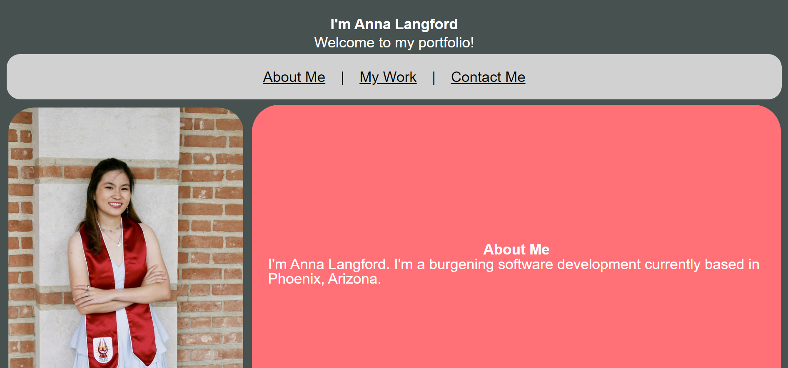
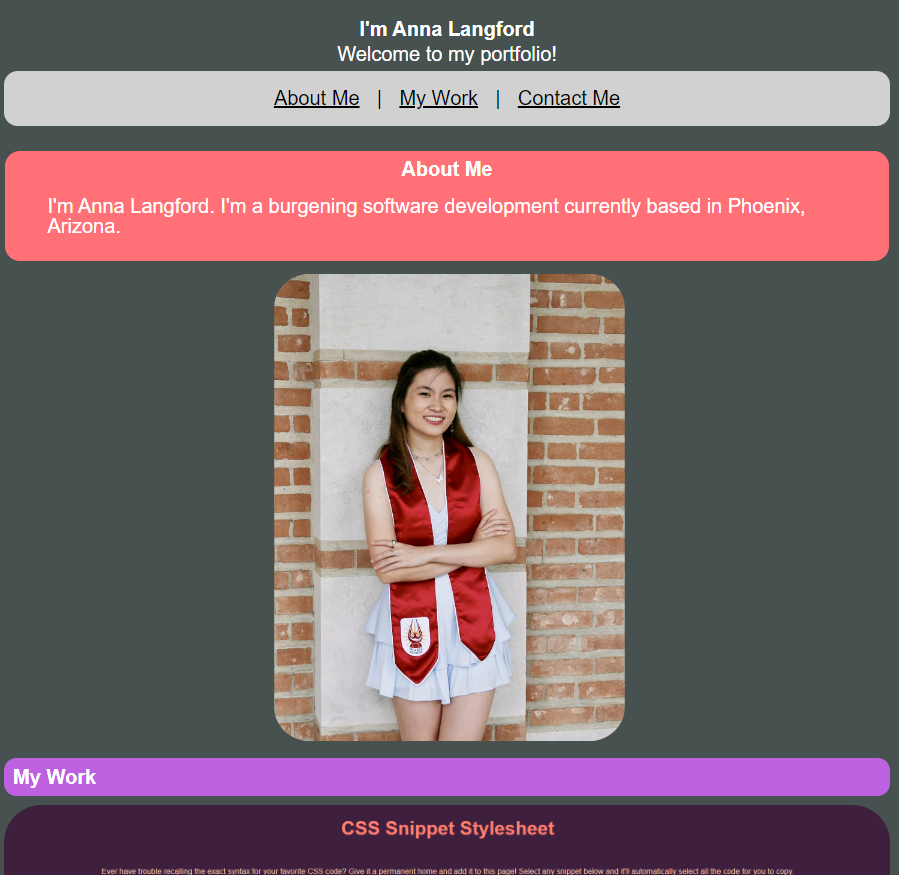

# md2-professional-portfolio

## Description 

This webpage is a professional portfolio for possible employers to be able to look at my experience and previous work. This application will also alow possible employers to see a current photo of me, as well as a brief description of myself which includes my current location, and eventually a specialty or area of work I am particularly interested, as well as previous, relevant employment. 

This application includes a navigational header which includes operating links to later sections of the web application, and under the "My Work" section, the application features previously made applications, which include a screenshot, a link to the application, and a brief description of it. Future projects are intended to have the same layout as the first project, but smaller in size. 

By finishing this project, I was able to practice using and generating semantic HTML as well as more advanced CSS tricks. By using and practicing more advanced CSS, I gained a better understanding of it. 

--
## Table of Contents

- [Instalation](#instalation)
- [Usage](#usage)
- [Credits](#credits)
- [License](#license)

--

## Instalation

N/A

## Usage

To navigate to this webpage, please [click here](https://anna-dxj.github.io/md2-professional-portfolio/). In a desktop view, the website should appear like the screenshot below: 

In a mobile view, the website should appear like the screenshot below: 

.

To access Chrome DevTools, access the webpage from Google Chrome, and press Command+Option+I (MacOS) or Control+Shift+I (Windows). A console will appear on the webpage, and you mayinspect the structure and CSS properties of the webpage through the concole. 

## Credits

I have consulted a few websites for help and/or inspiration for this project:

For aesthetic inspiration, I looked at multiple websites from this [list](https://www.hostinger.com/tutorials/web-developer-portfolio).

I took particular inspiration from The Craftsmen's [portolio](https://www.thecraftsmen.tech/), in regards to some aesthetics. 

I also looked at the css-tricks [website](https://css-tricks.com/almanac/properties/t/transition/) for help with the :hover transition in regards to opacity. 

## License

MIT License

Copyright (c) [2022] [Anna Langford]

Permission is hereby granted, free of charge, to any person obtaining a copy
of this software and associated documentation files (the "Software"), to deal
in the Software without restriction, including without limitation the rights
to use, copy, modify, merge, publish, distribute, sublicense, and/or sell
copies of the Software, and to permit persons to whom the Software is
furnished to do so, subject to the following conditions:

The above copyright notice and this permission notice shall be included in all
copies or substantial portions of the Software.

THE SOFTWARE IS PROVIDED "AS IS", WITHOUT WARRANTY OF ANY KIND, EXPRESS OR
IMPLIED, INCLUDING BUT NOT LIMITED TO THE WARRANTIES OF MERCHANTABILITY,
FITNESS FOR A PARTICULAR PURPOSE AND NONINFRINGEMENT. IN NO EVENT SHALL THE
AUTHORS OR COPYRIGHT HOLDERS BE LIABLE FOR ANY CLAIM, DAMAGES OR OTHER
LIABILITY, WHETHER IN AN ACTION OF CONTRACT, TORT OR OTHERWISE, ARISING FROM,
OUT OF OR IN CONNECTION WITH THE SOFTWARE OR THE USE OR OTHER DEALINGS IN THE
SOFTWARE.